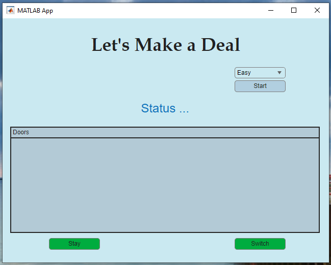

# Let's Make a Deal Game: Monty Hall Simulation in MATLAB

This project is a **Monty Hall problem simulation** built with **MATLAB App Designer**.  
The app allows users to interactively play the famous probability puzzle, exploring the effect of staying or switching doors.  

---

## 📂 Repository Structure
Fibonacci-Calculator/
- `src/` : MATLAB source code (`.mlapp` and `.m` files).
- `preview/` : Screenshots and flowcharts used in the report.

---

## Features
- 🎮 Interactive GUI built in **MATLAB App Designer**.  
- 🎯 Three difficulty modes:
  - Easy → 3 doors
  - Medium → 5 doors
  - Hard → 7 doors
- 🤖 Automatic reveal of a **"ZONK!"** door.  
- ✨ Player decision: **Stay** or **Switch**.  
- 📊 Reinforces concepts of probability and decision-making strategies.  

---

## How It Works
1. Select the difficulty mode (Easy, Medium, or Hard).  
2. Click **Start** to generate the doors.  
3. Pick a door.  
4. The system opens one "ZONK!" door.  
5. Decide whether to **Stay** with your choice or **Switch** to another door.  
6. The app reveals all doors and shows whether you win or lose.  

---

## Preview
## User Interface
.

## Gameplay Examples
| Easy (3 doors) | Medium (5 doors) | Hard (7 doors) | Final Result |
|----------------|------------------|----------------|--------------|
|  |  |  |  |

## Flowchart
The following flowchart shows the core logic of the game:

---

## Requirements
- MATLAB **R2025a** or later  
- App Designer Toolbox  

---

## References
- MATLAB App Designer, Release 2025a – The MathWorks, Inc.  
- Ross, Sheldon M. *Introduction to Probability Models*, Academic Press, 2014.  
- Vos Savant, Marilyn. *Parade Magazine*, 1990 – Original Monty Hall problem article.  

## Author
- **Sri Kusmiyati**  
Class: Algorithm and Computation  
Lecturer: Muhammad Qomaruz Zaman  

